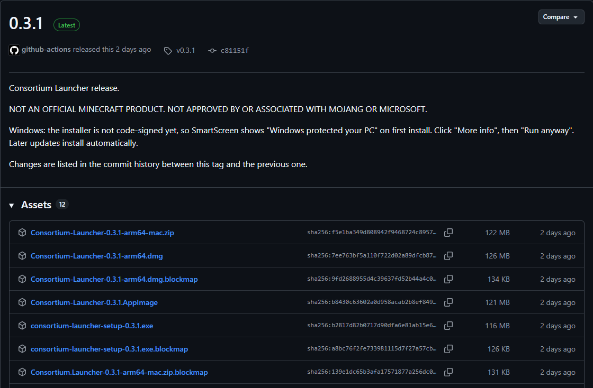
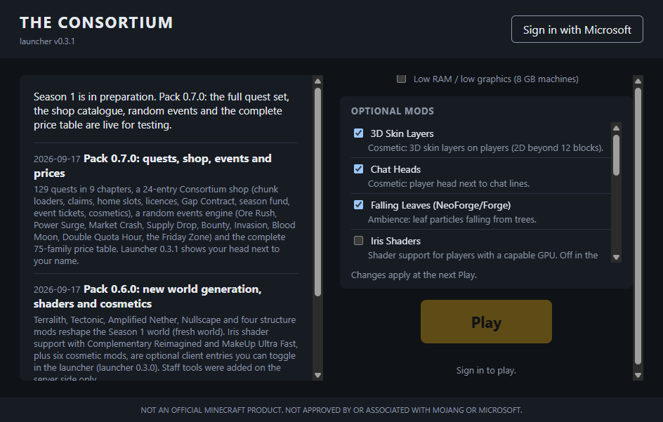
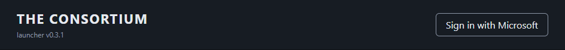
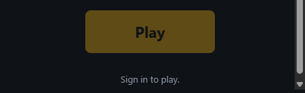
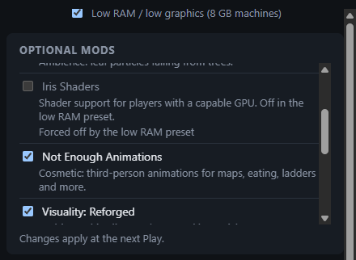
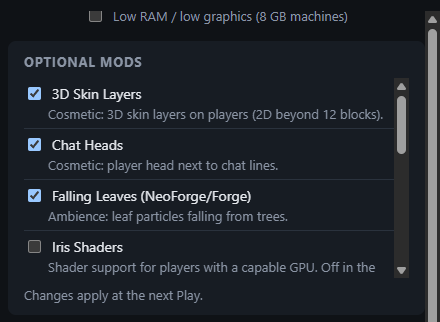
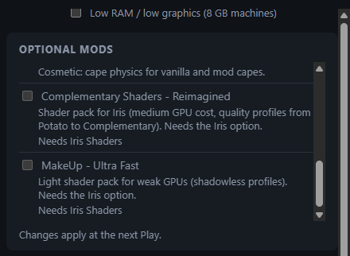

# Consortium Launcher: install guide

This guide takes you from nothing installed to standing in the world of *The Consortium*. It is
written for launcher **0.3.1** and pack 0.7; the screenshots come from that version. If a screen
looks different, check the release notes on GitHub or ask on Discord.

> NOT AN OFFICIAL MINECRAFT PRODUCT. NOT APPROVED BY OR ASSOCIATED WITH MOJANG OR MICROSOFT.

The launcher does one thing: it signs you in with your own Microsoft account, installs the exact
game, loader and mod versions the server runs, keeps them up to date and starts the game. It never
sees your password, contains no purchase or donation flow, and everything it downloads comes from
Mojang, NeoForge, Modrinth, the FTB Maven and the pack's own GitHub page. The full list of hosts is
in the [README](../README.md#network-endpoints).

Using it is optional: if you would rather install NeoForge 21.1.250 and the mods by hand, the
official Minecraft Launcher joins the server exactly the same way.

## Contents

1. [Before you start](#1-before-you-start)
2. [Download](#2-download)
3. [Install on Windows](#3-install-on-windows)
4. [Sign in with Microsoft](#4-sign-in-with-microsoft)
5. [The first Play](#5-the-first-play)
6. [Joining the server](#6-joining-the-server)
7. [The 8 GB preset](#7-the-8-gb-preset)
8. [Optional mods and shaders](#8-optional-mods-and-shaders)
9. [Updates](#9-updates)
10. [Troubleshooting](#10-troubleshooting)
11. [Uninstall and data folders](#11-uninstall-and-data-folders)
12. [macOS and Linux](#12-macos-and-linux)
13. [For maintainers: the screenshots](#13-for-maintainers-the-screenshots)

## 1. Before you start

You need:

- **Windows 10 or 11, 64-bit.** macOS (Apple Silicon) and Linux builds exist too, see section 12.
- **A Microsoft account that owns Minecraft: Java Edition**, with a player name already chosen.
  If you have never opened the official Minecraft Launcher with this account, do it once first:
  the launcher refuses accounts without a Java Edition profile. Game Pass players must also open
  the official launcher once so the profile exists.
- **RAM:** 16 GB recommended. 8 GB works with the *Low RAM / low graphics* preset of section 7.
  Below 8 GB the modpack will not run well.
- **Disk:** about 400 MB for the launcher itself, plus about 1.3 GB downloaded at the first Play
  (game files and assets about 1 GB, Java 21 about 95 MB, the mods about 140 MB, measured on
  2026-09-20 with pack 0.7). Keep at least 3 GB free for updates, saves, screenshots and the
  optional shader packs.
- **A graphics driver that runs vanilla Minecraft 1.21.** Shaders (section 8) want a dedicated GPU.
- **An invitation.** The server is whitelisted: staff add your player name after you join the
  Discord. The launcher cannot get you in without it.

Nothing else: the launcher installs its own Java 21, so you do not need Java on the machine.

## 2. Download

Open the latest release page:

**https://github.com/underfr/consortium-launcher/releases/latest**

Scroll to **Assets** and download the file for your system:

| System | File |
|---|---|
| Windows 10 / 11 (64-bit) | `consortium-launcher-setup-<version>.exe` (about 116 MB) |
| macOS on Apple Silicon | `Consortium-Launcher-<version>-arm64.dmg` |
| Linux (x64) | `Consortium-Launcher-<version>.AppImage` |

Ignore the `.blockmap`, `.zip`, `.yml` and *Source code* entries: they are for the auto-updater and
for developers. Every asset shows its SHA-256 next to it if you want to check the download.

## 3. Install on Windows

1. Run `consortium-launcher-setup-<version>.exe`.
2. **Windows SmartScreen** shows a blue box titled *Windows protected your PC*. The launcher is not
   code-signed yet (a paid certificate is planned), so Windows does not know the publisher. Click
   **More info**, then **Run anyway**. This happens once: later updates install by themselves
   without the prompt.
3. The installer has no questions. It installs for your Windows user only (no administrator
   rights needed) under `%LOCALAPPDATA%\Programs\consortium-launcher`, creates a Start menu entry
   and a desktop shortcut called **Consortium Launcher**, and opens the launcher when it is done.

If your antivirus asks about the installer, allow it: the file was downloaded from the project's
own GitHub release page, and its SHA-256 is printed on that page.

## 4. Sign in with Microsoft

The first window looks like this. The left card shows the server news; the right column holds the
settings and the **Play** button, which stays greyed out with *Sign in to play.* under it until you
are signed in.

1. Click **Sign in with Microsoft** in the top-right corner.

   

2. Your normal web browser opens Microsoft's sign-in page (`login.microsoftonline.com`). The button
   in the launcher reads *Waiting for the browser...* meanwhile. Sign in with the Microsoft account
   that owns Minecraft: Java Edition. The password is typed on Microsoft's page, in your browser,
   never in the launcher.
3. Microsoft asks you to let **Consortium Launcher** (publisher: underfr) sign you in to Xbox Live
   and keep that access. Accept. Those are the two standard permissions every third-party
   launcher needs; the launcher can read your player name, skin and game ownership, nothing else.
4. The browser then shows *Sign-in complete: You are signed in. You can close this tab and go back
   to the Consortium Launcher.* Close the tab.
5. Back in the launcher, the button has become a chip with your player head and your player name,
   with a small **Sign out** link next to it. You stay signed in between launches: the launcher
   keeps a refresh token in Windows' protected storage (DPAPI), so you will not see Microsoft's page
   again unless you sign out or the token expires.

You have five minutes to finish in the browser; after that the launcher gives up and you click
**Sign in with Microsoft** again.

## 5. The first Play

1. Optional, but do it now if your machine has 8 GB of RAM: tick **Low RAM / low graphics (8 GB
   machines)** above the *Optional mods* card (section 7).
2. Click the gold **Play** button.

   

3. The button reads **Preparing...** and a progress block appears under it, one phase at a time:

   | Phase | What is downloaded | First run, about |
   |---|---|---|
   | **Java** | Java 21 from Mojang's runtime manifest | 95 MB |
   | **Minecraft** | Minecraft 1.21.1 client, libraries and assets, each file checked against Mojang's hash | 1 GB |
   | **NeoForge** | NeoForge 21.1.250 through its official installer, run on your machine | included above |
   | **Mods** | the pack: mods, configs and scripts (the optional entries you left ticked included) | 140 MB |
   | **Launch** | *Starting Minecraft* | |

   The bar shows the count or the size done (for example `412.3 MB / 1.02 GB`); it slides when a
   phase has no known total. The first run takes a few minutes on a typical connection, longer on
   a slow one. Do not close the launcher during it: if you do, the next Play simply resumes.

4. The button switches to **Running** and the game window opens. Everything is greyed out in the
   launcher while the game runs; when you close the game the launcher is ready again.

Later Plays only download what changed since the last time (a new pack version, a changed
config) and start the game within seconds.

The game keeps its own `options.txt` in the instance folder (section 11). Your key bindings, video
settings and resource packs are yours to change in the game as usual; the launcher only touches a
handful of graphics values, and only when the low preset is on.

## 6. Joining the server

Today the game opens on its **title screen**: the launcher can hand the server address to the game
and join it directly, but the address is only filled in once the season server is up. Until then:

1. Open **Multiplayer**, then **Add Server**.
2. Type the address staff posted on Discord (PLACEHOLDER: the address is announced with the season
   start) and click **Done**, then join.

Once the address is published in the pack, the game joins the server by itself at every Play and
you will see the world instead of the title screen. If the server answers *You are not
whitelisted on this server*, your player name has not been added yet: post it on Discord exactly as
the launcher shows it.

## 7. The 8 GB preset

Tick **Low RAM / low graphics (8 GB machines)** above the *Optional mods* card. It applies at the
next Play and does three things:

- gives the game a 3 GB Java heap instead of the default (4 GB on an 8 GB machine, 6 GB on a
  16 GB machine, otherwise 40 % of the RAM between 2 and 8 GB), which leaves room for Windows and
  your browser;
- writes light graphics values into the game's `options.txt` at every Play while the preset is on:
  render distance 6, graphics *Fast*, clouds off, particles *Minimal*, entity shadows off, 60 FPS
  cap. You can still change them in the game for the session; they come back at the next Play;
- holds **Iris Shaders** off, which also holds the two shader packs off (they need Iris). The rows
  turn grey with the note *Forced off by the low RAM preset* or *Needs Iris Shaders*.

Untick the box to go back to the defaults at the next Play; your own choices in the card come back
with it.

## 8. Optional mods and shaders

The *Optional mods* card lists the entries of the pack that are yours to choose. They are all
client-side: whatever you pick, you play on the same server with everyone else. The list comes from
the pack, so it can grow with a pack update; today it holds nine entries:

| Entry | Default | What it is |
|---|---|---|
| 3D Skin Layers | on | Cosmetic: 3D skin layers on players (2D beyond 12 blocks). |
| Chat Heads | on | Cosmetic: player head next to chat lines. |
| Falling Leaves (NeoForge/Forge) | on | Ambience: leaf particles falling from trees. |
| Iris Shaders | off | Shader support for players with a capable GPU. Off in the low RAM preset. |
| Not Enough Animations | on | Cosmetic: third-person animations for maps, eating, ladders and more. |
| Visuality: Reforged | on | Ambience: hit, slime and ore sparkle particles. |
| Wavey Capes | on | Cosmetic: cape physics for vanilla and mod capes. |
| Complementary Shaders - Reimagined | off | Shader pack for Iris (medium GPU cost, quality profiles from Potato to Complementary). Needs the Iris option. |
| MakeUp - Ultra Fast | off | Light shader pack for weak GPUs (shadowless profiles). Needs the Iris option. |

Rules of the card:

- A tick means the file is downloaded at the next Play; an untick means it is removed at the next
  Play. Nothing changes while the game runs, hence the footer *Changes apply at the next Play.*
- The list scrolls: the two shader packs are at the bottom.
- The shader packs stay locked with *Needs Iris Shaders* until you tick **Iris Shaders**. Tick Iris
  first, then the pack you want; the ticks are remembered.

  

- The low preset (section 7) holds Iris and both packs off; untick the preset to get them back.
- If the launcher is offline before the first Play, the card says *Optional mods appear after the
  first launch.*; restart the launcher once you are online, or press Play: the list is read again.

**Turning shaders on in the game.** Ticking a shader pack only downloads it. In the game, open
Options, Video Settings, **Shader Packs** and select the pack. Complementary Reimagined is the
prettier one and wants a dedicated GPU; MakeUp - Ultra Fast is the light one. If your frame rate
drops, pick a lower profile in the pack's own settings or turn shaders off again: the server does
not care either way.

## 9. Updates

- **The launcher** checks GitHub Releases every time it starts. A thin banner under the header
  tells you what is happening: *Checking for launcher updates...*, *Update X found,
  downloading...*, *Downloading update: N%*, then *Update X is ready.* with a **Restart to
  update** button. Click it, or just quit: the update installs when the launcher closes and there
  is no SmartScreen prompt for updates. Updates are downloaded over HTTPS and verified against the
  checksum published with the release before they are applied. *Update check failed: ...* only
  means GitHub could not be reached; the launcher works as before.
- **The pack** (mods, configs, scripts) is checked at every Play: what changed is downloaded, what
  was removed is deleted, your optional choices are kept. The news card on the left announces pack
  versions and what they bring. There is nothing to do on your side.
- **The game and NeoForge** are pinned to the versions the server runs (Minecraft 1.21.1,
  NeoForge 21.1.250 for Season 1) and only change when the server does.

## 10. Troubleshooting

Errors appear in a red box under the Play button; sign-in errors also show as a page in your
browser. The most common ones:

| You see | What it means, what to do |
|---|---|
| *The Microsoft sign-in was cancelled. Click Sign in to try again.* | The browser tab was closed or Microsoft's page was cancelled. Click **Sign in with Microsoft** again. |
| *The Microsoft sign-in timed out after 5 minutes.* | Same fix: start again and finish in the browser within five minutes. |
| *Could not open a local port for the Microsoft sign-in. Try again.* | Something blocks local connections on your machine (a strict firewall or VPN client). Retry; if it persists, allow the launcher in the firewall or pause the VPN during sign-in. |
| *This Microsoft account does not own Minecraft: Java Edition. ...* | You signed in with the wrong account, or the account plays through Game Pass and has never opened the official Minecraft Launcher. Fix that and sign in again. |
| *This account has no Minecraft: Java Edition profile (player name) yet. ...* | Open the official Minecraft Launcher once, choose your player name, come back. |
| *This account needs adult verification on https://www.xbox.com ...* or a message about a child account | Xbox Live rules for young accounts: a parent has to add the account to a family on xbox.com. |
| *Mojang has not approved this launcher's app registration yet ...* | Nothing to fix on your side: tell the admins on Discord. |
| *Your session expired. Sign in again.* | Click **Sign out**, then **Sign in with Microsoft**. |
| *Could not load server news. Check your connection.* | No network, or `underfr.github.io` is blocked. The news is cosmetic, but the same host serves the pack, so Play will fail too. |
| *Sign in with your Microsoft account first.* | Play was pressed while signed out. |
| *Minecraft closed with exit code N. Check the game log if it crashed.* | The game crashed or was killed. The log is `%APPDATA%\consortium-launcher\logs\game-latest.log` (section 11). Exit code 1 with an out-of-memory line: tick the 8 GB preset. Send the log on Discord if you cannot read it. |
| A phase fails with a checksum or download error | A file arrived damaged or a host is blocked (the list is in the README). Press Play again: finished files are kept and only the missing ones are fetched. Antivirus software sometimes quarantines `runtime\java21\bin\java.exe` or `javaw.exe` on the first run: restore it and exclude the folder, then Play again. |
| *Update check failed: ...* in the banner | GitHub unreachable. Harmless; try later. |
| The game stutters or freezes on an 8 GB machine | Tick **Low RAM / low graphics (8 GB machines)** and close the browser while playing. Shaders are for 16 GB machines with a dedicated GPU. |
| The game opens on the title screen | Normal until the server address is published (section 6). Add the server by hand. |
| *You are not whitelisted on this server* | Post your exact player name on Discord; staff add it. |
| The window is empty or the launcher will not start | Delete `%APPDATA%\consortium-launcher\state\settings.json` (your preset and option choices reset to defaults) and start again. If it still fails, uninstall, delete the data folder (section 11) and reinstall; keep `instances\consortium\saves` and `screenshots` if you want them. |

When you ask for help, attach two files: `%APPDATA%\consortium-launcher\logs\main.log` (the
launcher) and `%APPDATA%\consortium-launcher\logs\game-latest.log` (the game, rewritten at every
Play). They contain paths and version numbers, never your token.

Paste `%APPDATA%\consortium-launcher` into the address bar of the Windows file explorer to open the
folder.

## 11. Uninstall and data folders

Where things live on Windows:

| Folder | Contents |
|---|---|
| `%LOCALAPPDATA%\Programs\consortium-launcher` | the launcher program |
| `%APPDATA%\consortium-launcher` | everything the launcher downloads and keeps: `runtime\java21` (Java), `minecraft` (game files, libraries, assets), `instances\consortium` (the game folder: `mods`, `config`, `kubejs`, `options.txt`, `saves`, `screenshots`, `resourcepacks`, `shaderpacks`), `state` (`settings.json` with your preset and option choices, the sign-in token `auth.bin`, the pack sync state, cached skins), `logs` (`main.log`, `game-latest.log`) |
| `%LOCALAPPDATA%\consortium-launcher-updater` | downloaded launcher updates, before they are applied |

To uninstall:

1. Windows Settings, **Apps**, **Installed apps**, find **Consortium Launcher**, **Uninstall**. This
   removes the program and the shortcuts.
2. The uninstaller leaves your data alone. Delete `%APPDATA%\consortium-launcher` yourself to
   remove the game files, the mods, the settings and the sign-in token (about 1.3 GB), and
   `%LOCALAPPDATA%\consortium-launcher-updater` if it exists. Copy `instances\consortium\saves` and
   `instances\consortium\screenshots` somewhere first if you want to keep them.
3. To remove the launcher's access to your Microsoft account entirely, open
   https://account.live.com/consent/Manage and remove **Consortium Launcher**. Signing out in the
   launcher already deletes the token from your machine.

## 12. macOS and Linux

The release page carries a macOS build for Apple Silicon (`Consortium-Launcher-<version>-arm64.dmg`;
Intel Macs are not covered) and a Linux x64 AppImage. They are the same launcher with the same
screens; the differences (unverified on real machines at the time of writing, please report):

- **macOS:** open the `.dmg`, drag the app to Applications. The build is neither signed nor
  notarized, so macOS refuses the first start: open **System Settings**, **Privacy & Security**,
  scroll to the message about Consortium Launcher and click **Open Anyway** (older macOS versions
  accept a right-click, **Open** instead). The refresh token goes to the Keychain. Data folder:
  `~/Library/Application Support/consortium-launcher`.
- **Linux:** `chmod +x Consortium-Launcher-<version>.AppImage`, then run it. The refresh token is
  stored in the desktop keyring (secret-service); without a keyring the launcher does not store
  it and asks you to sign in again next time rather than write it unencrypted. Data folder:
  `~/.config/consortium-launcher`.

## 13. For maintainers: the screenshots

The PNG files under `docs/img/` are captured from the real window, never mocked, and refreshed at
every release that changes a screen. The helper `tools/devtest/launcher-shot.ps1` (in the modpack
repository, next to the dev test harness) starts the launcher, waits for its window, renders it
with `PrintWindow` (which works even when another window covers it and never brings it to the
front), crops the client area and closes it; it moves the stored sign-in aside so the window is
signed out, can write a temporary `settings.json` for the low preset, and can scroll a list before
the capture through `--remote-debugging-port` and `tools/devtest/launcher-eval.mjs`. Details in
`tools/devtest/README.md`.

| File | State | Capture |
|---|---|---|
| `00-release-page.png` | the GitHub release page, cropped to the release card | a hidden Electron window loading the page (scratch script, not kept) |
| `01-home-signed-out.png` | first window, signed out, defaults | `launcher-shot.ps1 -Out 01-home-signed-out.png` |
| `02-sign-in.png` | header crop of 01 | crop 0,0 944x84 |
| `03-play.png` | Play area crop of 01 | crop 476,412 440x135 |
| `04-low-preset.png` | preset ticked, list scrolled to Iris | `-State low-preset -Evaluate "document.querySelector('.option-list').scrollTop = 140"`, crop 476,96 440x322 |
| `05-optional-mods.png` | defaults, top of the list | crop 476,96 440x322 of 01 |
| `06-shader-packs.png` | defaults, list scrolled to the bottom | `-Evaluate "var l = document.querySelector('.option-list'); l.scrollTop = 100000"`, same crop |

Still to capture, with the owner's own sign-in (`-KeepAuth`, the owner signs in first; the harness
never enters credentials): the signed-in header with the head chip, *Preparing...* with the
progress block, *Running*, the SmartScreen dialog on a fresh Windows account, and Microsoft's page
in the browser. Never use `SetForegroundWindow` or a screen copy for these: the first attempt
captured the owner's fullscreen game instead of the launcher.
